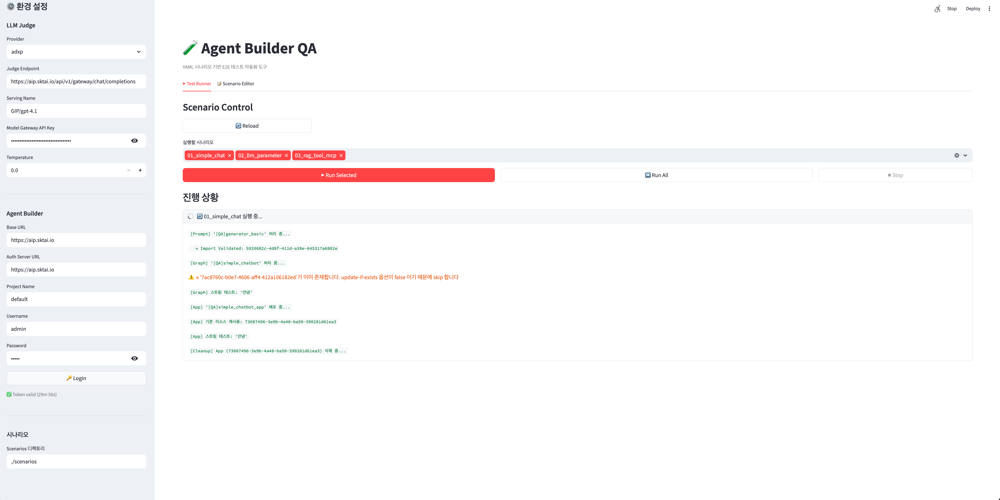
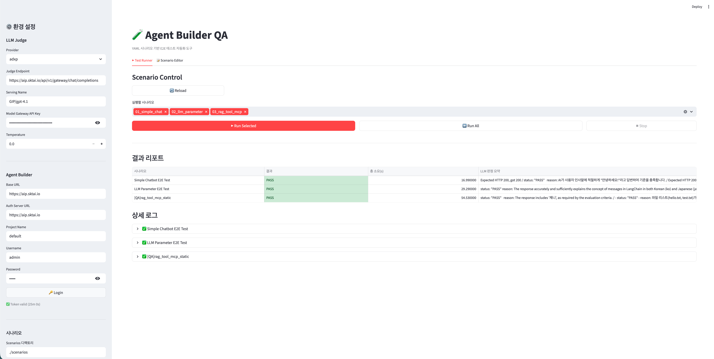
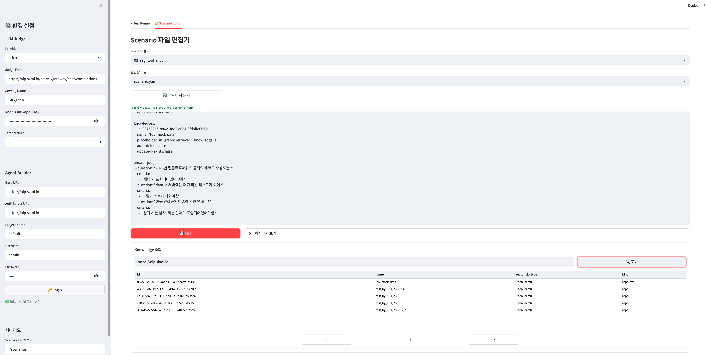
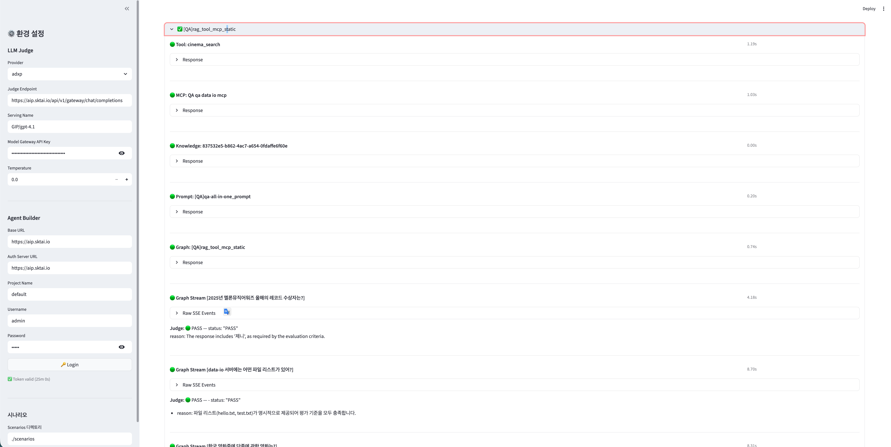

# Agent Builder QA

Agent Builder를 통해 생성된 Prompt, Graph, App의 무결성을 검증하는 **E2E 테스트 자동화 도구**입니다.

YAML 기반 시나리오로 API 호출 연쇄를 자동화하고, LLM을 활용해 응답의 적절성을 판정합니다.

---

## 프로젝트 구조

```
agent-builder-qa/
├── scenarios/                  # 테스트 시나리오 (YAML + JSON)
│   ├── 01_simple_chat/
│   ├── 02_llm_parameter/
│   ├── 03_rag_tool_mcp/
│   └── 04_translator/
├── core/                       # 공유 핵심 로직
│   ├── engine.py               # 시나리오 실행 엔진
│   ├── judge.py                # LLM Judge 로직
│   └── models.py               # Pydantic 데이터 모델
├── app_streamlit/              # Streamlit UI 앱
│   └── main.py
└── app_cli/                    # CLI / K8s CronJob 앱
    └── main.py
```

---

## 실행 방법

### Streamlit UI (개발·검증 환경)

**1. 환경 변수 파일 설정**

```bash
cp .env.example .env
# .env 파일을 열어 Base URL, 인증 정보 등 실제 값으로 수정
```

**2. 가상환경 생성 및 활성화**

Python 3.10+ 환경을 준비합니다. 사용하는 도구에 따라 아래 중 하나를 선택하세요.

```bash
# venv
python -m venv .venv
source .venv/bin/activate        # macOS/Linux
.venv\Scripts\activate           # Windows

# conda
conda create -n agent-builder-qa python=3.10
conda activate agent-builder-qa
```

**2. 의존성 설치**

```bash
pip install -r requirements.txt
```

**3. 프로젝트 루트에서 Streamlit 실행**

```bash
cd /path/to/agent-builder-qa
streamlit run app_streamlit/main.py
```

Sidebar에서 API Key, Base URL, Admin Token을 설정하고 시나리오를 선택해 실행합니다.

---

## 화면 구성

### Test Runner — 실행 중


### Test Runner — 결과 리포트


### Scenario Editor — 파일 편집 및 Knowledge 조회


### 상세 로그 — LLM Judge 판정 결과


---

### CLI (자동화 / CronJob) ⚠️ 개발 예정

> **현재 미완성 상태입니다.** Streamlit UI를 띄울 수 없는 환경(K8s CronJob 등)에서
> shell script로 시나리오를 실행하기 위한 구조만 잡혀 있으며, 아직 동작하지 않습니다.

```bash
# 단건 실행
python app_cli/main.py --scenario 01_simple_chat

# 전체 실행
python app_cli/main.py --all
```

실패 시 exit code `1` 반환 (CI 연동 지원).

---

## 시나리오 구성

각 시나리오는 디렉토리 단위로 관리되며, `scenario.yaml`과 JSON 리소스 파일로 구성됩니다.

```
scenarios/01_simple_chat/
├── scenario.yaml
├── graph_*.json
├── prompt_*.json
└── request.json
```

### scenario.yaml 예시

```yaml
scenario_name: "Simple Chatbot E2E Test"

graph:
  name: "[QA]simple_chatbot"
  id: 7ac8760c-b0e7-4606-aff4-412a106182ed
  file_path: "./scenarios/01_simple_chat/graph_simple_chatbot.json"
  auto-delete: true
  update-if-exists: false

app:
  name: "[QA]simple_chatbot_app"
  auto-delete: true

llms:
  - placeholder_in_graph: generator_01_serving_name
    replace_to: "GIP/gpt-4.1"

prompts:
  - name: "[QA]generator_basic"
    id: 5920682c-4d0f-411d-a38e-645317a6802e
    json_path: "./scenarios/01_simple_chat/prompt_5920682c-4d0f-411d-a38e-645317a6802e.json"
    auto-delete: true
    update-if-exists: false

answer-judge:
  request_json_path: "./scenarios/01_simple_chat/request.json"
  criteria:
    - "인사말에 적절히 대답해야 함"
    - "HTTP Status 200"
```

**주요 필드**

| 필드 | 설명 |
|------|------|
| `id` | graph.json에 하드코딩된 UUID. 이 id로 리소스 생성/검증 |
| `json_path` | 생성/업데이트 시 request body로 사용할 JSON 파일 경로 |
| `auto-delete` | 테스트 완료 후 자동 삭제 여부 |
| `update-if-exists` | 동일 id 리소스 존재 시 업데이트 여부 (기본값: false) |
| `placeholder_in_graph` | graph.json 내 `@@...@@` 형식의 LLM serving_name 플레이스홀더 key |

---

## 실행 흐름

1. **Environment Setup** - LLM 설정 및 Base URL 로드
2. **Scenario Loading** - `scenarios/` 디렉토리의 YAML 스캔
3. **리소스 준비** - Prompts → Tools → MCPs → Graph 순서로 처리
   - UUID로 존재 여부 확인 → 없으면 Import API로 생성, 있으면 `update-if-exists` 설정에 따라 처리
   - graph.json 내 `@@...@@` LLM 플레이스홀더를 `llms` 항목으로 치환
4. **App 배포 및 테스트** - App 생성 → Stream API 호출 → LLM 판정
5. **Cleanup** - `auto-delete: true` 리소스 삭제 (App → Graph → Prompt 순)

---

## 환경 변수 (CLI / CronJob)

| 변수명 | 설명 |
|--------|------|
| `BASE_URL` | Agent Builder Base URL |
| `ADMIN_TOKEN` | Admin 인증 토큰 |
| `LLM_API_KEY` | LLM Judge용 API Key |
| `LLM_MODEL` | LLM Judge 모델명 |
| `SCENARIO` | 실행할 시나리오명 (`all` 또는 디렉토리명) |

---

## 개발자 / 운영자 가이드

코드 수정, 시나리오 추가, 코어 로직 변경 등을 진행하려면 아래 문서를 참고하세요.

👉 **[DEVELOPER_GUIDE.md](DEVELOPER_GUIDE.md)**

---

## 기술 스택

- **Python** 3.10+
- **Streamlit** - UI
- **LangChain** - LLM Judge
- **httpx** - HTTP 클라이언트
- **PyYAML** / **Pydantic** - 데이터 파싱 및 검증
